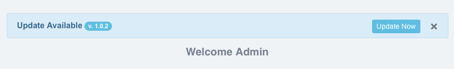

# LaraUpdater v2 - maintained fork

> This is **`mdylan/laraupdater`**, a maintained fork of
> [pcinaglia/laraupdater](https://github.com/pietrocinaglia/laraupdater) by
> [MDylan](https://github.com/MDylan). The original package has not been released
> since 2018-12-03.
>
> **v2 is not a drop-in replacement for v1.** The package name, the namespace and
> the route middleware all changed - see the change log below.

## Installing (v2)

The package is not on Packagist. Add the repository, then require it:

```json
"repositories": [
    { "type": "vcs", "url": "https://github.com/MDylan/laraupdater" }
],
"require": {
    "mdylan/laraupdater": "^2.0"
}
```

Auto-discovery registers the provider. To register it by hand instead:

```php
'providers' => [
    // ...
    MDylan\LaraUpdater\LaraUpdaterServiceProvider::class,
];
```

Publish the config, language files and the sample view:

```
php artisan vendor:publish --provider="MDylan\LaraUpdater\LaraUpdaterServiceProvider"
```

## v2 change log

### Breaking

- Package renamed `pcinaglia/laraupdater` -> **`mdylan/laraupdater`**, so the
  install path becomes `vendor/mdylan/laraupdater`. A self-updating host app must
  clean up the old `vendor/pcinaglia/` tree from its release `upgrade.php`,
  because `install()` only ever adds and overwrites files - it never deletes.
- Namespace `pcinaglia\laraUpdater` -> **`MDylan\LaraUpdater`**. The old
  declaration used a capital `U` while the PSR-4 map used a lowercase one; that
  only ever worked because PHP class lookups are case-insensitive, and it
  produced a mismatched entry under `composer dump-autoload --optimize`.
- `updater.check` and `updater.currentVersion` now sit behind
  `config('laraupdater.middleware')` as well. In v1 they carried no middleware
  at all - not even `web` - so anyone could read the installed version.
- All three routes are named (`laraupdater.check`, `laraupdater.currentVersion`,
  `laraupdater.update`). The URIs are unchanged. Generate links with `route()`
  rather than hardcoding `/updater.update`, which breaks in subdirectory installs.
- The controller extends `Illuminate\Routing\Controller` instead of the host
  app's `App\Http\Controllers\Controller`, which the Laravel 11 skeleton no
  longer ships.

### Fixed

- `update()` compares versions with `version_compare()`, not string comparison.
  As strings `"1.1.10" <= "1.1.5"` is TRUE, which hid every release past `x.x.9`.
- `getCurrentVersion()` trims `version.txt`. A trailing newline makes
  `version_compare("1.1.5", "1.1.5\n", ">")` return TRUE, i.e. the app would
  advertise an update forever.
- `migrate` runs with `--force`. Without it the command asks for confirmation in
  production and the update request hangs.
- `optimize:clear` runs after a successful install. It reaches `clear-compiled`,
  which deletes `bootstrap/cache/packages.php` - so a release that changes the
  installed package set cannot boot into a stale-discovery-cache fatal.
- The `catch` around `migrate` was `catch(Exception $e)` unqualified inside a
  namespace, so it resolved to a class that does not exist and never caught
  anything. It is `\Throwable` now.
- `loadTranslationsFrom()` pointed at `src/lang`, which does not exist. The
  `laraupdater::` namespace resolved to nothing.
- Language files publish to `lang_path()` on Laravel 9+ and `resource_path('lang')`
  below that.
- `checkPermission()` no longer fatals on `Auth::user()->id` when nobody is
  authenticated; it denies instead.
- The default `tmp_path` is `/tmp`, not `/../tmp`. The path is resolved against
  `base_path()`, so the old default pointed outside the project.

### Added

- Multi-step updates: a manifest may declare `previous_version`, and the updater
  installs that intermediate release first so its migrations are not skipped.
- `getDescription()` returns the changelog of the pending release, served from the
  same cache entry as `check()`.
- Manifest reads are cached for `version_check_time` minutes, and an unreachable
  channel degrades to "no update" instead of throwing.
- `request_timeout` (10s) and `download_timeout` (60s) config keys. A bare
  `file_get_contents()` has no timeout, and `check()` runs on every admin page
  render.
- Laravel 8.12 - 13 and PHP 8.0+ support declared in `composer.json`.

### Known limitations (unchanged from v1)

- `update()` writes raw HTML with `echo` and ends with `exit`, outside the
  response lifecycle. It cannot be unit tested and ignores middleware buffering.
- An update archive containing `upgrade.php` gets that file `include`d and its
  `main()` called. This is by design, and it means the update channel must be
  trusted absolutely - it is remote code execution with extra steps.
- `version.txt` lives at `base_path().'/version.txt'` and is not configurable.

---
## Author
* **Pietro Cinaglia** - Contact me using [GitHub](https://github.com/pietrocinaglia) or [LinkedIn](https://linkedin.com/in/pietrocinaglia)


# LaraUpdater [ self-update for your Laravel App ]

LaraUpdater allows your Laravel Application to auto-update itself ! ;)

When you release an application is most important maintain it; therefore, could be necessary to publish an update for bugs fixing as well as for new features implementation.

You deploy your App for several users:

WITHOUT LaraUpdate => Do you want to contact them one by one and send them the update using an email or a link ? ...mmm...very bad becouse each user (with admin role) have to overwrite manually all files on his deployment; or, you have to access manually all deployments (e.g. using FTP) and install for them the update.

#### WITH LaraUpdater => Let your application (ALONE) detects that a new update is available and notifies its presence to the administrator; furthermore, let your application install it and handles all related steps.

### NEW VERSION change-log 
[ thanks to salihkiraz :) ]
- multi lang. supported
- sample views add
- laravel package auto discover added
- laravel 5.7 tested
- zip file extract fixed


## Features:

#### > Self-Update
LaraUpdater allows your Laravel Application to self-update :)
Let your application (ALONE) detects that a new update is available and notifies its presence to the administrator; furthermore, let your application install it and handles all related steps.

#### > Maintenance Mode
LaraUpdate activates the maintenance mode (using the native Laravel command) since the update starts until it finishes with success.

#### > Security
You can set which users  (e.g. only the admin) can perform an update for the application; this parameter is stored in the `config/laraupdater.php` so each application can sets its users indipendently. Furthermore, LaraUpdater is compatible with Laravel-Auth.

#### > Fault tolerant
During the update LaraUpdate BACKUPS all files that are overwritten, so if an error occurs it can try to restore automatically the previous state. If the restoring fails, you can use the backup stored in the root of your system for a manual maintenance.

#### > Supports UPGRADE script
LaraUpdate can import a PHP script to perform custom actions (e.g. create a table in database after the update); the commands are performed in the last step of update.


## Getting Started

These instructions will get you a copy of the project up and running on your server for development and testing purposes.

### Prerequisites

LaraUpdater has been tested using Laravel 5.4
Recommended Laravel Version >= 5.x


## Installing

This package can be installed through Composer:
```
composer require pcinaglia/laraupdater
```

After installation you must perform these steps:

#### 1) add the service provider in `config/app.php` file:

```
'providers' => [
    // ...
    pcinaglia\laraupdater\LaraUpdaterServiceProvider::class,
];
```

#### 2) publish LaraUpdater in your app
This step will copy the config file in the config folder of your Laraver App.

```
php artisan vendor:publish --provider="pcinaglia\laraupdater\LaraUpdaterServiceProvider"
```

When it is published you can manage the configuration of LaraUpdater through the file in `config/laraupdater.php`, it contains:

```
    /*
    * Temp folder to store update before to install it.
    */
    'tmp_path' => '/../tmp',

    /*
    * URL where your updates are stored ( e.g. for a folder named 'updates', under http://site.com/yourapp ).
    */
    'update_baseurl' => 'http://site.com/yourapp/updates',

    /*
    * Set a middleware for the route: updater.update
    * Only 'auth' NOT works (manage security using 'allow_users_id' configuration)
    */
    'middleware' => ['web', 'auth'],

    /*
    * Set which users can perform an update; 
    * This parameter accepts: ARRAY(user_id) ,or FALSE => for example: [1]  OR  [1,3,0]  OR  false
    * Generally, ADMIN have user_id=1; set FALSE to disable this check (not recommended)
    */
    'allow_users_id' => [1] 
```

#### 3) Create version.txt
To store current version of your application you have to create a text file named `version.txt` and copy it in the main folder of your Laravel App.
For example, create a .txt file that contains only:
```
1.0
```
...use only 1 row, the first, of the .txt file.
When release an update this files is updated from LaraUpdate.


## Create your update "repository"

#### 1) Create the Archive
Create a .zip archive with all files that you want replace during the update (use the same structure of your application to organize the files in the archive).

#### 1.1) Upgrade Script (optional)
You can create a PHP file named `upgrade.php` to perform custom actions (e.g. create a new table in the database).
This file must contain a function named `main()` with a boolean return (to pass the status of its execution to LaraUpdater), see this example:
```
<?php

function main(){

	command-1-to-connect-db
	command-2-to-create-table
	command-3-to-insert-data
	
	return true;
}
?>
```
Note that the above example does not handle any exceptions, so the status of its execution return always true (not recommended).


#### 2) Set the Metadata for your Update:

Create a file named `laraupdater.json` like this:
```
{
	"version": "1.0.2",
	"archive": "RELEASE-1.02.zip",
	"description": "Minor bugs fix"
}
```
`archive` contains the name for the .zip Archive (see Step-1).


#### 3) Upload your update

Upload `laraupdater.json` and .zip Archive in the same folder of your server (the one that will host the update).

	
#### 4) Configure your application

Set the server that will host the update in `config/laraupdater.php` (see Installing):

For example, if you upload files under:

	http://yoursites.com/updatesformyapp/RELEASE-1.02.zip
	and http://yoursites.com/updatesformyapp/laraupdater.json

set `'update_baseurl'` as follows: `'update_baseurl' => 'http://yoursites.com/updatesformyapp',`


## Usage

LaraUpdater implements three main methods that you can call using the routes:

#### updater.check
Returns '' (an update not exist) OR $version (e.g. 1.0.2, if an update exist).

#### updater.currentVersion
Returns the current version of your App (from `version.txt`).

#### updater.update
It downloads and installs the last update available.
This route is protected using the information under `'allow_users_id'` in `config/laraupdater.php`


I suggest, to not use directly these routes BUT to show an Alert when an update is available; the Alert could be contain a Button to perform the update, see the solution below:


### (Example) Bootstrap 4 and JQuery solution



Add to `view/layout/app.blade.php` this HTML code (I suggest immediately before of `@yield('content')`):
```
<div id="update_notification" style="display:none;" class="alert alert-info">
	<button type="button" style="margin-left: 20px" class="close" data-dismiss="alert" aria-label="Close">
		<span aria-hidden="true">&times;</span>
	</button>
</div>            
```

, now add (at the end of `view/layout/app.blade.php`) this JQuery script:    
```
<script>
    $(document).ready(function() {  
        $.ajax({
            type: 'GET',   
            url: 'updater.check',
            async: false,
            success: function(response) {
                if(response != ''){
                    $('#update_notification').append('<strong>Update Available <span class="badge badge-pill badge-info">v. '+response+'</span></strong><a role="button" href="updater.update" class="btn btn-sm btn-info pull-right">Update Now</a>');
                    $('#update_notification').show();
                }
            }
        });
    });
</script>
```

<< END >> ...to test it: publish an update and refresh the page to show the alert :-)

## License

This project is licensed under the MIT License - see the [LICENSE](LICENSE) file for details.

(MIT License - WARRANTY Info) THE SOFTWARE IS PROVIDED "AS IS", WITHOUT WARRANTY OF ANY KIND, EXPRESS OR IMPLIED, INCLUDING BUT NOT LIMITED TO THE WARRANTIES OF MERCHANTABILITY, FITNESS FOR A PARTICULAR PURPOSE AND NONINFRINGEMENT. IN NO EVENT SHALL THE AUTHORS OR COPYRIGHT HOLDERS BE LIABLE FOR ANY CLAIM, DAMAGES OR OTHER LIABILITY, WHETHER IN AN ACTION OF CONTRACT, TORT OR OTHERWISE, ARISING FROM, OUT OF OR IN CONNECTION WITH THE SOFTWARE OR THE USE OR OTHER DEALINGS IN THE SOFTWARE.

